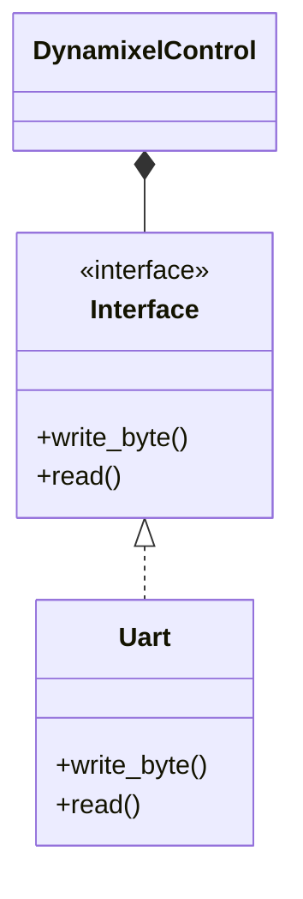

# dynamixel-f-rs
[](https://github.com/chama1176/dynamixel-f-rs/actions/workflows/rust.yml)

## How Implemented
- parseのコードはmainループか受信割り込みで遅れ少なく呼ぶように実装する
- 制御ループはparseのコードとは別でタイマ割り込みを実施する（制御ループの方が高優先度）
- 基本即時返信で良いので、waitを入れて返信する機能は未実装

## 使い方
- TODO:

## Class Diagram
TODO: 要修正


## Get started
For generate documentation.
```bash
cargo doc --open
```

