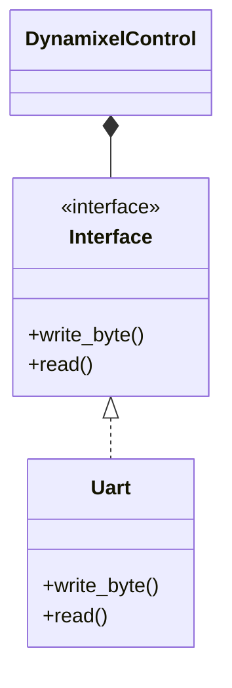

# dynamixel-f-rs
[](https://github.com/chama1176/dynamixel-f-rs/actions/workflows/rust.yml)

## やりたいこと
- parseのコードはmainループか受信割り込みで遅れ少なく呼ばれるイメージ
- 制御ループは別でタイマ割り込みを実施する
- parse終了のタイミングでwait usを加算して次に返すタイミングを決める
- ほんとは受信したタイミングをbyteと一緒に管理した方がよい？
- 基本即時返信で良いので、parseの中で最後にread bytes呼んだ時間とかでとりあえずは動きそう


## Class Diagram


## Get started
For generate documentation.
```bash
cargo doc --open
```

### For Linux

```
sudo gpasswd -a ユーザ名 dialout
```

```
sudo chmod 666 /dev/ttyUSB0
```

```
cat /sys/bus/usb-serial/devices/ttyUSB0/latency_timer
```
